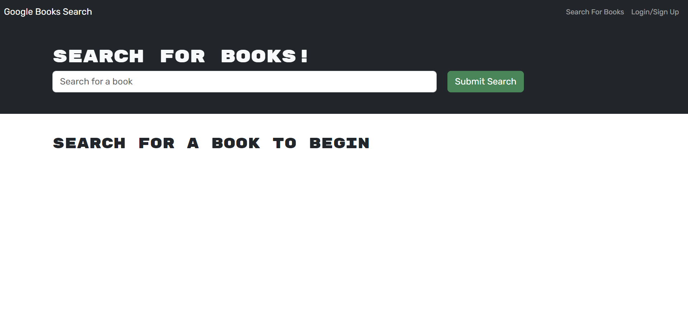
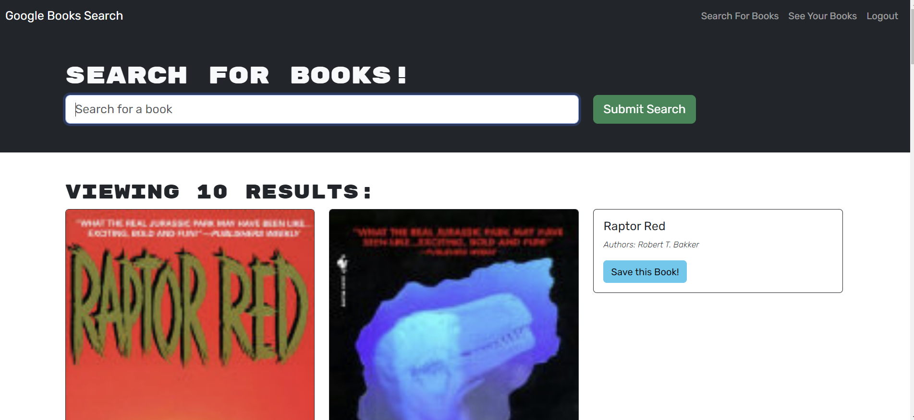
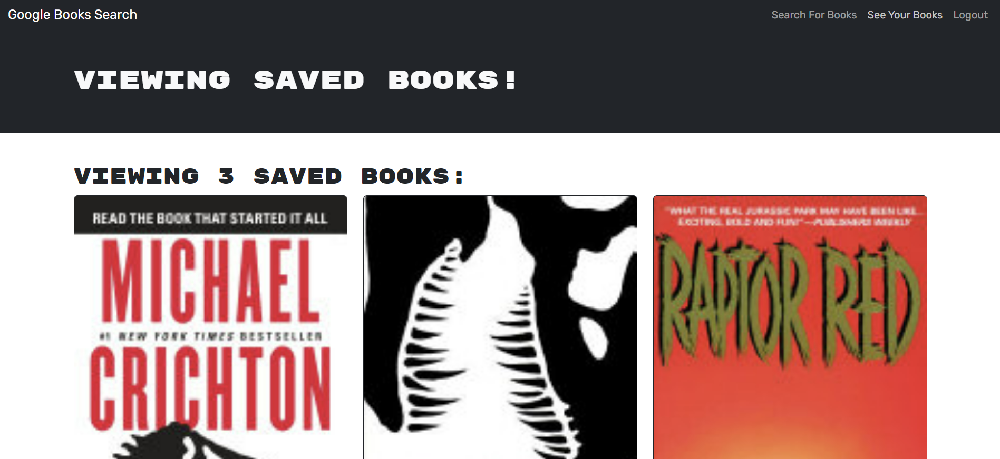

# WhichBook

This is a book search engine that allows users to search for books, save them to their account, and view their saved books.

## Features:

- Search for books by title, author, or subject
- Save books to your account
- View your saved books
- Log in and out of your account

## Usage:

1. Load the search engine
2. Enter a search term in the input field and click the submit button
3. Browse the search results and click on a book to view more information about it
4. If you are logged in, you can click the Save button to save the book to your account
5. To view your saved books, click on the option to see my saved books
6. To remove a book from your saved books list, click on the Remove button

## Logging in and signing up:

To log in or sign up for an account, click on the Login/Signup menu option.

If you are not logged in, you will see a modal with a toggle between the option to log in or sign up.

- To sign up, enter a username, email address, and password and click on the signup button.
- To log in, enter your email address and password and click on the login button.

## Saving and removing books:

- To save a book to your account, click on the Save button on the book's information page.

- To remove a book from your saved books list, click on the Remove button on the book's information page or on the saved books page.

## Logging out:

To log out of the site, click on the Logout button in the menu.

## Requirements:

A web browser with JavaScript enabled

## Screenshots:

## Links:

Deployed application: https://whichbooks-86aa2aaea065.herokuapp.com/  
GitHub repository: https://github.com/Flagg217/WhichBook  
